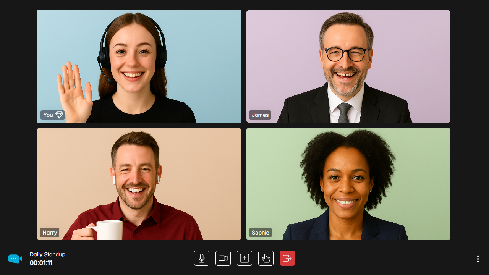
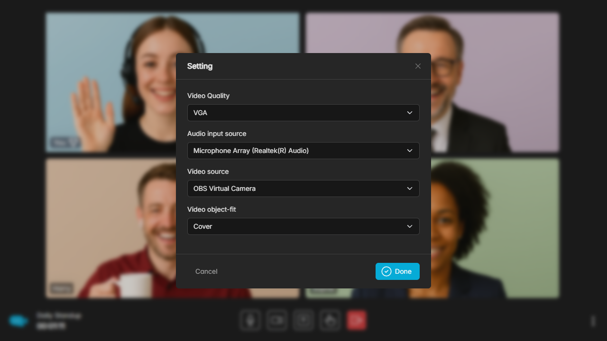
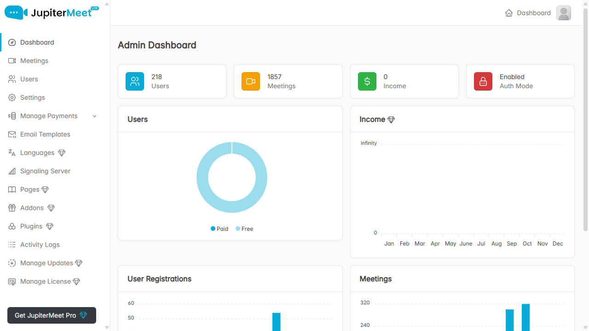
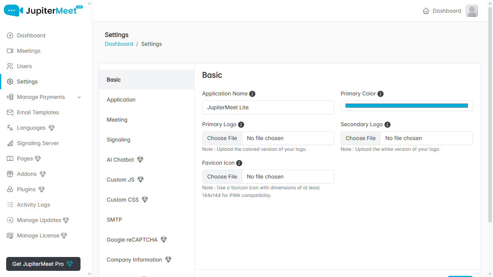
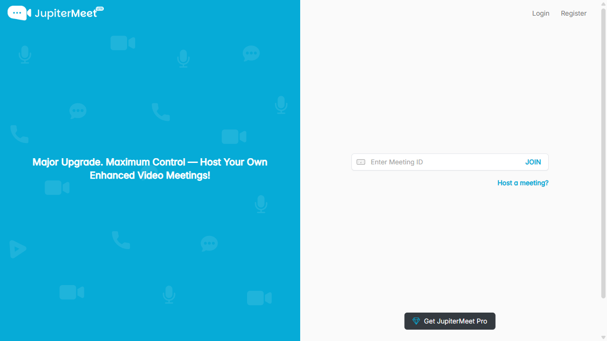
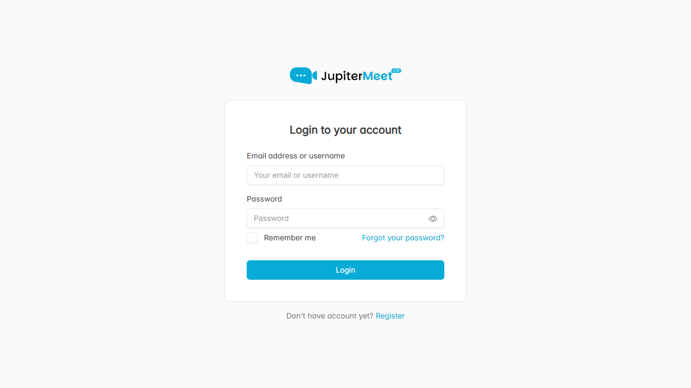
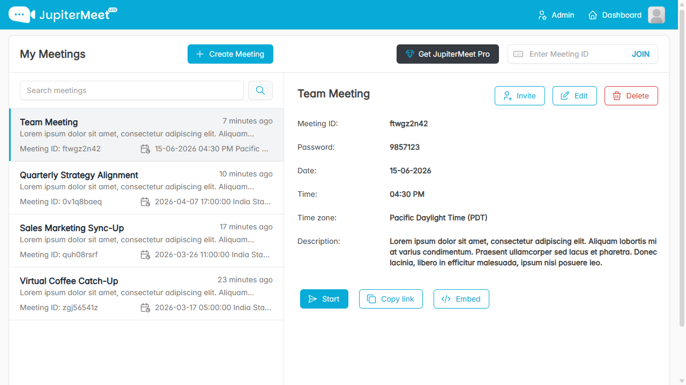
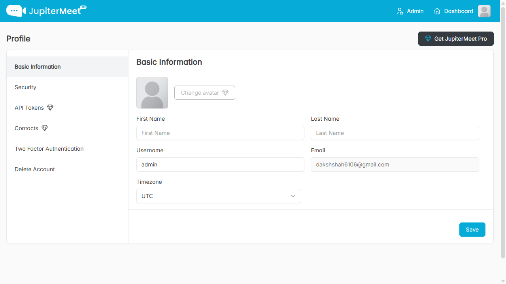
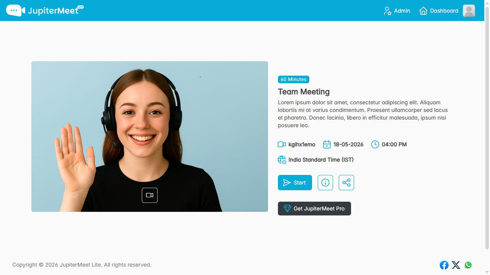

# JupiterMeet Lite

The open-source version of [JupiterMeet](https://jupitersoftwares.io/products/jupitermeet), a self-hosted video conferencing solution built with WebRTC.

It comes with its own signaling server and does not rely on any third-party paid APIs or meeting services. This means you can host unlimited video meetings on your own server with full control over your data, branding, and infrastructure.

JupiterMeet Lite is designed for developers, startups, and teams who want a lightweight, customizable, and self-hosted WebRTC meeting solution without usage-based costs.

---

## Screenshots

### Meeting Experience


 
<br><br>


### Administration Settings
 

### User Interface
 
<br><br>
  

---

## Key Features

JupiterMeet Lite includes the essential features needed to run a simple, secure, and self-hosted video conferencing platform.

- **Low-latency WebRTC meetings:** Host real-time video meetings with minimal delay using WebRTC.
- **High-quality video meetings:** Deliver smooth and clear video conferencing directly from the browser.
- **Group chat:** Let participants send messages during live meetings.
- **Meeting dashboard:** Manage and access meetings from a simple user dashboard.
- **Admin panel:** Control users, meetings, and basic platform settings from one place.
- **White-label:** Customize the platform with your own branding.
- **Moderation control:** Allow moderators to manage meeting access and participant permissions.
- **Device control:** Let users toggle camera and microphone, and switch available media devices.
- **Two-factor authentication:** Add an extra security layer to user accounts.
- **Activity logs:** Track important user and admin activities inside the platform.

## Upgrade to JupiterMeet Pro

JupiterMeet Pro adds advanced features for SaaS businesses, larger teams, and platforms that need more control, automation, and customization.

- **Payment mode:** Turn your video conferencing platform into a SaaS product with paid plans.
- **Screen sharing:** Let participants share their screen during meetings.
- **Collaborative whiteboard:** Draw, write, and collaborate visually during live meetings.
- **AI chatbot:** Access AI assistants during meetings for quick help and answers.
- **AI meeting assistant:** Generate meeting transcriptions and summaries.
- **Addon and plugin support:** Extend the platform with addons and third-party integrations.
- **Meeting APIs:** Create and manage users and meetings through APIs.
- **PWA:** Install the platform as a Progressive Web App for a native-like experience.
- **Multilingual:** Offer the platform in multiple languages.
- **Personal meeting links:** Give users static meeting links they can reuse.
- **Contact management:** Save and manage frequent meeting contacts.
- **Meeting history:** Let users view past meetings from their dashboard.
- **Page management:** Create and manage custom pages from the admin panel.
- **Custom JS and CSS:** Add custom scripts and styles without editing the core code.
- **Social logins and Google reCAPTCHA:** Enable faster logins and protect forms from spam.
- **Google Analytics:** Track platform traffic and user activity.
- **Dark theme support:** Offer a dark interface for a better viewing experience.

**Get JupiterMeet Pro here:** [https://jupitersoftwares.io/products/jupitermeet-pro](https://jupitersoftwares.io/products/jupitermeet-pro)

---
## Tech Stack

JupiterMeet Lite is built with a modern, self-hosted web stack using Laravel for the application backend and Node.js for real-time WebRTC signaling.

| Layer | Technology |
| --- | --- |
| **Backend Framework** | Laravel 12.x |
| **PHP Version** | PHP 8.3 or higher |
| **Signaling Server** | Node.js with Socket.IO |
| **Database** | MySQL |
| **Frontend** | Blade templates and JavaScript |

---

## System Requirements

Before installing JupiterMeet Lite, make sure your server meets the minimum requirements below.

| Requirement | Minimum Version |
| --- | --- |
| **PHP** | 8.3 or higher |
| **Node.js** | 18.x or higher |
| **npm** | Required |
| **Database** | MySQL 8.0 or higher |

> A VPS or dedicated server with at least 2 GB of RAM is recommended because the Node.js signaling server requires a server environment where background services can run properly.

---

## Installation Guide

JupiterMeet Lite is quick and easy to install:

1. **Clone the Repository & Navigate:**
   ```bash
   git clone https://github.com/your-username/jupitermeet-open.git jupitermeet_lite
   cd jupitermeet_lite
   ```

2. **Setup Laravel Environment & Dependencies:**
   ```bash
   cp .env-example .env
   composer install
   ```

3. **Setup Signaling Server Environment & Dependencies:**
   ```bash
   cd server
   cp .env-example .env
   npm install
   ```

4. **Complete Installation via Web Installer:**
   Open your domain/URL in your web browser (e.g., `https://yourdomain.com`). You will be automatically redirected to the Laravel web installer wizard to complete the configuration steps (database connection, application environment, and admin account setup).

## License

This project is licensed under the [MIT License](LICENSE).
